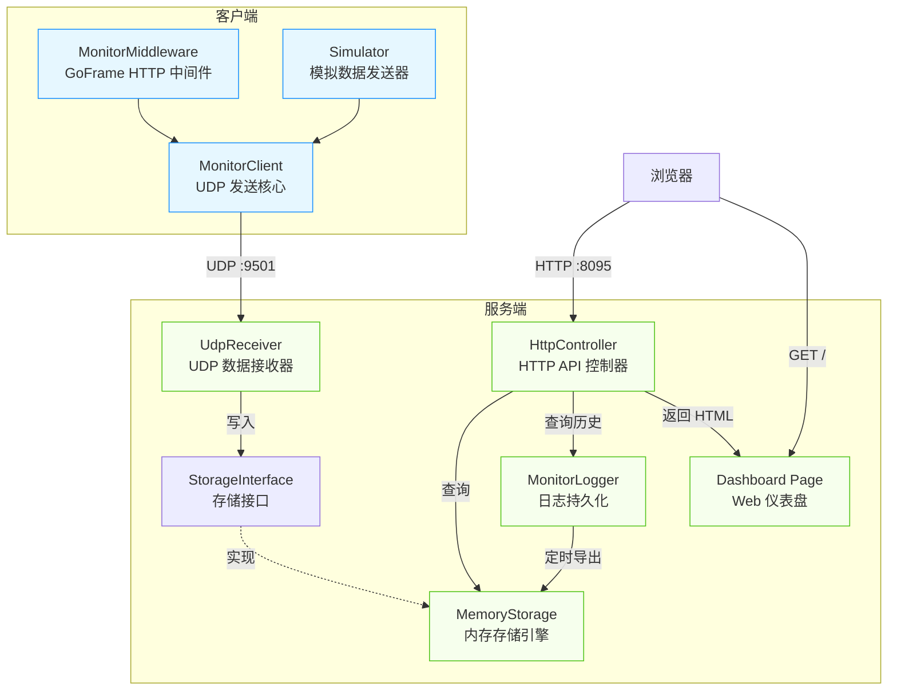
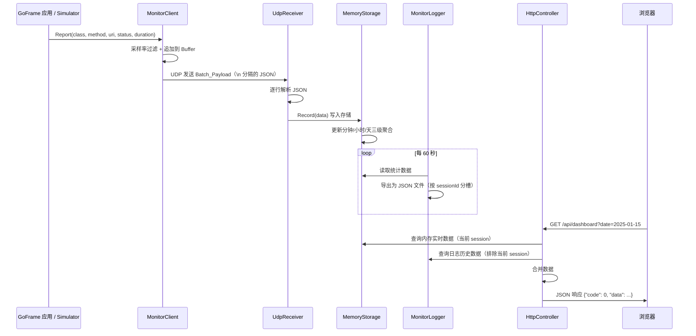

# 技术设计文档：API Monitor Golang 完整版

## 概述

本设计文档描述 Golang 版 API 性能监控系统的完整技术方案，包含客户端和服务端两部分，功能对标现有 PHP 版本（`examples/api-monitor/`）。

### 目标

- 实现完整的 Golang 版 API 性能监控系统（客户端 + 服务端）
- API 接口和数据格式与 PHP 版完全兼容，前端仪表盘页面直接复用
- 复用 `golang-sdk` 中的 `serializer` 包（JSON 序列化）和 `observability` 包（日志记录）
- 使用 GoFrame v2 框架提供 HTTP 服务
- 先只实现内存存储模式，不依赖 Redis

### 设计原则

1. **兼容性优先**：所有 API 接口路径、参数、返回格式与 PHP 版完全一致
2. **复用已有能力**：优先使用 golang-sdk 中的序列化器和日志组件
3. **简单可靠**：内存存储 + 日志持久化，无外部依赖，开箱即用
4. **并发安全**：所有共享数据结构使用读写锁保护

## 架构

### 系统架构图



### 数据流



### 项目目录结构

```
examples/api-monitor/golang/
├── cmd/
│   ├── server/
│   │   └── main.go              # 服务端 main 入口
│   └── simulator/
│       └── main.go              # 模拟客户端 main 入口
├── internal/
│   ├── client/
│   │   ├── monitor_client.go    # MonitorClient UDP 发送核心
│   │   └── middleware.go        # MonitorMiddleware GoFrame 中间件
│   └── server/
│       ├── storage.go           # StorageInterface 存储接口定义
│       ├── memory_storage.go    # MemoryStorage 内存存储引擎
│       ├── monitor_logger.go    # MonitorLogger 日志持久化
│       ├── udp_receiver.go      # UdpReceiver UDP 数据接收器
│       └── http_controller.go   # HttpController HTTP API 控制器
├── public/
│   └── index.html               # 复用 PHP 版仪表盘页面
├── config.yaml                  # YAML 配置文件
├── go.mod                       # Go Module 定义
├── go.sum
├── run-all.sh                   # Linux 一键启动脚本
├── run-all.bat                  # Windows 一键启动脚本
└── README.md                    # 项目文档
```

### 设计决策

| 决策 | 选择 | 理由 |
|------|------|------|
| HTTP 框架 | GoFrame v2 (`ghttp`) | 与项目中其他 Golang 示例保持一致 |
| UDP 实现 | Go 标准库 `net` 包 | 无需额外依赖，UDP 操作简单 |
| JSON 序列化 | golang-sdk `serializer` 包 | 复用已有能力 |
| 日志记录 | golang-sdk `observability` 包 | 复用已有能力 |
| 存储引擎 | 内存存储（MemoryStorage） | 无外部依赖，开箱即用 |
| 配置格式 | YAML（`config.yaml`） | 与 hello-world/golang 示例风格一致 |
| 项目结构 | `cmd/` + `internal/` | Go 标准项目布局，两个 main 入口 |
| 并发控制 | `sync.RWMutex` | Go 标准读写锁，适合读多写少场景 |

## 组件与接口

### 1. MonitorClient（UDP 发送核心）

**包路径**：`internal/client`

```go
// MonitorClient UDP 监控客户端
type MonitorClient struct {
    host       string
    port       int
    project    string
    sampleRate float64
    bufferSize int
    buffer     []string
    mu         sync.Mutex
    conn       net.Conn
    serializer serializer.Serializer
}

// NewMonitorClient 创建客户端实例
func NewMonitorClient(host string, port int, project string, sampleRate float64, bufferSize int) *MonitorClient

// Report 上报一条接口性能数据
func (c *MonitorClient) Report(class, method, uri string, status int, duration float64, params, response interface{})

// Flush 刷新缓冲区，立即发送所有待发送数据
func (c *MonitorClient) Flush()

// Close 关闭客户端，自动 Flush 剩余数据
func (c *MonitorClient) Close()
```

**关键行为**：
- `Report` 方法先进行采样率过滤，通过后构造 `MonitorRecord` 并用 `serializer.JsonSerializer` 序列化为 JSON 字符串，追加到 buffer
- buffer 满时自动 Flush，用 `\n` 拼接多条 JSON 后通过 UDP 发送
- UDP 发送失败静默忽略，不影响业务
- 使用 `sync.Mutex` 保护 buffer 的并发安全

### 2. MonitorMiddleware（GoFrame HTTP 中间件）

**包路径**：`internal/client`

```go
// NewMonitorMiddleware 创建 GoFrame 监控中间件
func NewMonitorMiddleware(client *MonitorClient, exclude []string, enabled bool) ghttp.HandlerFunc
```

**关键行为**：
- 实现 `ghttp.HandlerFunc`，可通过 `s.Use()` 注册为全局中间件
- 记录请求开始时间，在 `r.Middleware.Next()` 后计算耗时
- 从 GoFrame 请求对象提取 URI、状态码
- 从路由信息解析 class/method，降级时从 URI 路径提取
- 匹配 exclude 列表时跳过采集
- enabled 为 false 时直接放行

### 3. Simulator（模拟数据发送器）

**包路径**：`cmd/simulator/main.go`

```go
// 模拟 API 定义
type SimApi struct {
    Class    string
    Method   string
    URI      string
    MinTime  float64
    MaxTime  float64
}
```

**关键行为**：
- 预定义与 PHP 版 `simulate.php` 一致的 15 个模拟 API
- 每轮随机选 1~5 个 API，按加权概率生成状态码
- 在耗时范围内随机生成 duration，附带随机 params 和 response
- 每轮发送后随机等待 100ms~1000ms
- 终端彩色输出每条数据摘要
- 监听 SIGINT/SIGTERM 信号优雅退出

### 4. UdpReceiver（UDP 数据接收器）

**包路径**：`internal/server`

```go
// UdpReceiver UDP 数据接收器
type UdpReceiver struct {
    port    int
    storage StorageInterface
    conn    *net.UDPConn
    logger  observability.Logger
}

// NewUdpReceiver 创建 UDP 接收器
func NewUdpReceiver(port int, storage StorageInterface, logger observability.Logger) *UdpReceiver

// Start 启动 UDP 监听（阻塞，应在 goroutine 中调用）
func (r *UdpReceiver) Start(ctx context.Context) error

// Stop 停止 UDP 监听
func (r *UdpReceiver) Stop()
```

**关键行为**：
- 监听指定 UDP 端口，接收客户端数据
- 按 `\n` 分隔逐行解析 JSON
- 解析失败或缺少必要字段的行跳过，不中断处理
- 每个 UDP 包在独立 goroutine 中处理，支持并发

### 5. StorageInterface（存储接口）

**包路径**：`internal/server`

```go
// StorageInterface 监控数据存储接口
type StorageInterface interface {
    Record(data MonitorRecord)
    GetTree() map[string]map[string]map[string]string
    GetDashboard(date string) DashboardData
    GetDetail(project, class, method, date, granularity string) []DetailData
    GetSlowRanking(date string, limit int) []RankingItem
    GetCountRanking(date string, limit int) []RankingItem
    GetRealtime() []RealtimeItem
    Search(keyword, date string) []SearchItem
    GetDayTrend(date string) []TrendItem
    HasData(date string) bool
    GetRecords(project, class, method, minute string, limit int) []RecordItem
}
```

### 6. MemoryStorage（内存存储引擎）

**包路径**：`internal/server`

```go
// MemoryStorage 内存存储引擎
type MemoryStorage struct {
    mu          sync.RWMutex
    minuteStats map[string]map[string]*AggregationStats  // key -> minute -> stats
    hourStats   map[string]map[string]*AggregationStats  // key -> hour -> stats
    dayStats    map[string]map[string]*AggregationStats  // key -> day -> stats
    tree        map[string]map[string]map[string]string  // project -> class -> method -> uri
    records     map[string]map[string][]RecordItem        // key -> minute -> records
}
```

**关键行为**：
- 实现 `StorageInterface` 所有方法
- 按分钟/小时/天三级聚合，维护 count、success、fail、total_time、max_time、min_time
- HTTP 状态码 200~399 为成功，400+ 为失败
- 每个 key+minute 最多保留 200 条明细
- 自动清理超过 2 小时的明细记录
- 使用 `sync.RWMutex` 保护所有共享数据结构
- `GetDayTrend` 返回完整 1440 个数据点
- `GetRealtime` 返回最近 10 分钟数据
- `Search` 大小写不敏感匹配

### 7. MonitorLogger（日志持久化）

**包路径**：`internal/server`

```go
// MonitorLogger 日志持久化组件
type MonitorLogger struct {
    storage   StorageInterface
    logDir    string
    interval  int
    sessionId string
    logger    observability.Logger
    ticker    *time.Ticker
    stopCh    chan struct{}
}

// NewMonitorLogger 创建日志持久化组件
func NewMonitorLogger(storage StorageInterface, logDir string, interval int, logger observability.Logger) *MonitorLogger

// Start 启动定时导出
func (l *MonitorLogger) Start()

// Stop 停止定时导出并执行最后一次导出
func (l *MonitorLogger) Stop()

// Export 执行一次数据导出
func (l *MonitorLogger) Export()

// ReadDayLog 读取天级汇总日志（合并所有历史 session）
func (l *MonitorLogger) ReadDayLog(date string) *DayLogData

// ReadMinuteLog 读取分钟级明细日志
func (l *MonitorLogger) ReadMinuteLog(date string) *MinuteLogData

// ReadRecordsFromLog 从日志读取访问明细
func (l *MonitorLogger) ReadRecordsFromLog(date, project, class, method, minute string) []RecordItem

// GetAvailableDates 获取日志目录中的可用日期列表
func (l *MonitorLogger) GetAvailableDates() []string

// GetSessionId 获取当前 sessionId
func (l *MonitorLogger) GetSessionId() string
```

**关键行为**：
- 启动时生成唯一 `sessionId`（格式：`s_{timestamp}_{random6}`）
- 按配置间隔定时导出天级汇总文件（`{date}.json`）和分钟级明细文件（`{date}_minute.json`）
- 使用 sessionId 分槽存储，每次只更新当前 session 的槽位
- 读取时合并所有历史 session 数据（排除当前 session），与 PHP 版逻辑一致
- Stop 时触发最后一次导出

### 8. HttpController（HTTP API 控制器）

**包路径**：`internal/server`

```go
// HttpController HTTP API 控制器
type HttpController struct {
    storage  StorageInterface
    logger   *MonitorLogger
    password string
}

// NewHttpController 创建 HTTP 控制器
func NewHttpController(storage StorageInterface, logger *MonitorLogger, password string) *HttpController

// RegisterRoutes 注册所有路由到 GoFrame Server
func (c *HttpController) RegisterRoutes(s *ghttp.Server)
```

**路由映射**（与 PHP 版完全一致）：

| 路由 | 方法 | 处理函数 |
|------|------|----------|
| `GET /` | index | 返回仪表盘 HTML |
| `GET /api/dashboard` | dashboard | 仪表盘概览 |
| `GET /api/tree` | tree | 树形菜单 |
| `GET /api/detail` | detail | 接口详情 |
| `GET /api/ranking/slow` | rankingSlow | 慢速排行 |
| `GET /api/ranking/count` | rankingCount | 访问量排行 |
| `GET /api/realtime` | realtime | 实时访问量 |
| `GET /api/trend` | trend | 全天趋势 |
| `GET /api/search` | search | 搜索接口 |
| `GET /api/dates` | dates | 可用日期列表 |
| `GET /api/records` | records | 访问明细 |
| `POST /api/login` | login | 登录验证 |
| `GET /api/check-login` | checkLogin | 检查登录状态 |

**关键行为**：
- 所有 API 返回统一 JSON 格式：`{"code": 0, "data": ...}`
- 查询数据时合并内存实时数据与日志历史数据
- 合并排行榜时对相同接口累加统计数据并重新排序
- 登录凭证使用 `md5(password + "_monitor_salt")`，与 PHP 版兼容
- 仪表盘页面以 `text/html; charset=utf-8` 返回

## 数据模型

### MonitorRecord（监控记录）

```go
// MonitorRecord 单条监控数据记录
type MonitorRecord struct {
    Project   string      `json:"project"`
    Class     string      `json:"class"`
    Method    string      `json:"method"`
    URI       string      `json:"uri"`
    Status    int         `json:"status"`
    Duration  float64     `json:"duration"`   // 毫秒
    Timestamp int64       `json:"timestamp"`  // Unix 时间戳
    Params    interface{} `json:"params,omitempty"`
    Response  interface{} `json:"response,omitempty"`
}
```

### AggregationStats（聚合统计）

```go
// AggregationStats 聚合统计字段集合
type AggregationStats struct {
    Count     int     `json:"count"`
    Success   int     `json:"success"`
    Fail      int     `json:"fail"`
    TotalTime float64 `json:"total_time"`
    MaxTime   float64 `json:"max_time"`
    MinTime   float64 `json:"min_time"`
}
```

### DashboardData（仪表盘概览）

```go
// DashboardData 仪表盘概览数据
type DashboardData struct {
    Date        string  `json:"date"`
    TotalCount  int     `json:"total_count"`
    Success     int     `json:"success"`
    Fail        int     `json:"fail"`
    SuccessRate float64 `json:"success_rate"`
    AvgTime     float64 `json:"avg_time"`
}
```

### DetailData（接口详情）

```go
// DetailData 接口详情数据
type DetailData struct {
    Project string                        `json:"project"`
    Class   string                        `json:"class"`
    Method  string                        `json:"method"`
    URI     string                        `json:"uri"`
    Periods map[string]*AggregationStats  `json:"periods"`
}
```

### RankingItem（排行榜项）

```go
// SlowRankingItem 慢速排行项
type SlowRankingItem struct {
    Project string  `json:"project"`
    Class   string  `json:"class"`
    Method  string  `json:"method"`
    URI     string  `json:"uri"`
    AvgTime float64 `json:"avg_time"`
    MaxTime float64 `json:"max_time"`
    Count   int     `json:"count"`
}

// CountRankingItem 访问量排行项
type CountRankingItem struct {
    Project     string  `json:"project"`
    Class       string  `json:"class"`
    Method      string  `json:"method"`
    URI         string  `json:"uri"`
    Count       int     `json:"count"`
    Success     int     `json:"success"`
    Fail        int     `json:"fail"`
    SuccessRate float64 `json:"success_rate"`
}
```

### RealtimeItem / TrendItem（实时/趋势数据点）

```go
// TimeSeriesItem 时序数据点（实时和趋势共用）
type TimeSeriesItem struct {
    Time    string `json:"time"`
    Count   int    `json:"count"`
    Success int    `json:"success"`
    Fail    int    `json:"fail"`
}
```

### RecordItem（访问明细）

```go
// RecordItem 访问明细记录
type RecordItem struct {
    Time     string      `json:"time"`
    Duration float64     `json:"duration"`
    Status   int         `json:"status"`
    Params   interface{} `json:"params"`
    Response interface{} `json:"response"`
}
```

### SearchItem（搜索结果）

```go
// SearchItem 搜索结果项
type SearchItem struct {
    Project     string  `json:"project"`
    Class       string  `json:"class"`
    Method      string  `json:"method"`
    URI         string  `json:"uri"`
    Count       int     `json:"count"`
    SuccessRate float64 `json:"success_rate"`
    AvgTime     float64 `json:"avg_time"`
}
```

### 日志文件数据结构

**天级汇总文件**（`{date}.json`）：

```json
{
  "sessions": {
    "s_1713780000_a1b2c3": {
      "exported_at": "2025-01-15 10:30:00",
      "dashboard": { "date": "2025-01-15", "total_count": 1000, ... },
      "slow_ranking": [ ... ],
      "count_ranking": [ ... ],
      "tree": { "demo-project": { "UserController": { "index": "/api/user" } } }
    }
  }
}
```

**分钟级明细文件**（`{date}_minute.json`）：

```json
{
  "sessions": {
    "s_1713780000_a1b2c3": {
      "exported_at": "2025-01-15 10:30:00",
      "details": [
        {
          "project": "demo-project",
          "class": "UserController",
          "method": "index",
          "uri": "/api/user",
          "periods": { "2025-01-15 10:00": { "count": 5, ... } },
          "records": { "2025-01-15 10:00": [ { "time": "...", "duration": 35.6, ... } ] }
        }
      ]
    }
  }
}
```

### 配置文件结构（config.yaml）

```yaml
# 客户端配置
monitor:
  enabled: true
  udp_host: "127.0.0.1"
  udp_port: 9501
  project: "demo-project"
  sample_rate: 1.0
  buffer_size: 10
  exclude:
    - "/health"
    - "/favicon.ico"

# 服务端配置
server:
  http_port: 8095
  udp_port: 9501
  storage_driver: "memory"
  password: "888888"
  log:
    enable: true
    interval: 60
```

### 存储键格式

内存存储中使用 `{project}|{class}|{method}|{uri}` 作为复合键，与 PHP 版 `MemoryStorage` 完全一致。

### 时间格式

| 粒度 | 格式 | 示例 |
|------|------|------|
| 分钟 | `Y-m-d H:i` | `2025-01-15 10:30` |
| 小时 | `Y-m-d H` | `2025-01-15 10` |
| 天 | `Y-m-d` | `2025-01-15` |

Go 中对应的 `time.Format` 布局：
- 分钟：`2006-01-02 15:04`
- 小时：`2006-01-02 15`
- 天：`2006-01-02`


## 正确性属性

*属性是在系统所有有效执行中都应成立的特征或行为——本质上是对系统应做什么的形式化陈述。属性是人类可读规范与机器可验证正确性保证之间的桥梁。*

### Property 1: MonitorRecord 序列化 round-trip

*For any* 有效的 MonitorRecord 列表（1~N 条），将每条记录用 `serializer.JsonSerializer` 序列化为 JSON 字符串，用 `\n` 拼接为 Batch_Payload，然后按 `\n` 分隔逐行反序列化，应该得到与原始列表等价的 MonitorRecord 列表。

**Validates: Requirements 1.2, 1.5**

### Property 2: Buffer 行为不变量

*For any* buffer_size N（1~100）和任意 M 次 Report 调用（M < N），buffer 中应该恰好有 M 条记录；调用 Flush 后 buffer 应该为空。

**Validates: Requirements 1.3, 1.7**

### Property 3: Buffer 自动刷新

*For any* buffer_size N（1~100），连续调用恰好 N 次 Report 后，buffer 应该被自动清空（长度为 0）。

**Validates: Requirements 1.4**

### Property 4: MonitorRecord 字段完整性

*For any* 有效的 Report 参数（class, method, uri, status, duration, params, response），生成的 MonitorRecord 应该包含所有必要字段（project, class, method, uri, status, duration, timestamp），且当 params 非空时包含 params 字段，当 response 非空时包含 response 字段，当 params 为空时不包含 params 字段。

**Validates: Requirements 1.10, 1.11, 1.12**

### Property 5: URI 路径解析

*For any* 非空 URI 路径字符串，从 URI 中提取的 class 应该是首字母大写并以 "Controller" 结尾的字符串，method 应该是非空字符串（默认 "index"）。

**Validates: Requirements 2.5**

### Property 6: Exclude 路径匹配

*For any* URI 路径和 exclude 列表，如果 URI 以 exclude 列表中某个路径为前缀，则该 URI 应该被标记为排除；否则不应被排除。

**Validates: Requirements 2.6**

### Property 7: UDP 批量数据解析容错

*For any* 混合有效 JSON 行和无效行（随机字符串）的数据包，UdpReceiver 解析后写入 storage 的记录数应该恰好等于数据包中有效 MonitorRecord JSON 行的数量。

**Validates: Requirements 8.2, 8.3, 8.4**

### Property 8: 三级聚合统计正确性

*For any* 一组具有相同 key（project|class|method|uri）和相同日期的 MonitorRecord，写入 MemoryStorage 后，天级聚合的 count 应该等于记录总数，total_time 应该等于所有 duration 之和，max_time 应该等于最大 duration，min_time 应该等于最小 duration，success 应该等于状态码在 200~399 范围内的记录数，fail 应该等于状态码 >= 400 的记录数。

**Validates: Requirements 10.2, 10.3, 10.4, 10.8**

### Property 9: Tree 结构维护

*For any* 一组 MonitorRecord，写入 MemoryStorage 后，GetTree() 返回的树形结构应该包含所有记录中出现的 project/class/method 组合，且每个组合对应正确的 URI。

**Validates: Requirements 10.5**

### Property 10: 访问明细数量上限

*For any* 数量 N（N > 200）的同一 key 同一分钟的 MonitorRecord，写入 MemoryStorage 后，GetRecords 返回的明细数量不应超过 200 条。

**Validates: Requirements 10.6**

### Property 11: GetDayTrend 返回 1440 个数据点

*For any* 日期字符串，MemoryStorage 的 GetDayTrend 方法应该返回恰好 1440 个数据点，且每个数据点的 time 字段格式为 "YYYY-MM-DD HH:MM"。

**Validates: Requirements 10.10**

### Property 12: Search 大小写不敏感

*For any* 关键词字符串和 MemoryStorage 中的数据，Search(keyword) 和 Search(toUpper(keyword)) 应该返回相同的结果集。

**Validates: Requirements 10.12**

### Property 13: SessionId 唯一性

*For any* N 个 MonitorLogger 实例（N >= 2），每个实例的 sessionId 应该互不相同。

**Validates: Requirements 11.1**

### Property 14: Session 分槽存储隔离

*For any* 两个不同 sessionId 的 MonitorLogger，各自导出数据后，日志文件中应该包含两个独立的槽位，且读取时排除某个 sessionId 后不应包含该 session 的数据。

**Validates: Requirements 11.4, 11.7**

### Property 15: 排行榜合并累加

*For any* 两个排行榜列表（包含部分相同接口），合并后相同接口的 count 应该等于两个列表中该接口 count 之和，且结果按指定字段降序排列。

**Validates: Requirements 12.15, 12.16**

### Property 16: 登录凭证生成与验证 round-trip

*For any* 非空密码字符串，使用 `md5(password + "_monitor_salt")` 生成的凭证应该能通过 check-login 的验证（即 cookie 值等于凭证时返回 need_login=false），且任何不等于该凭证的 cookie 值应该返回 need_login=true。

**Validates: Requirements 14.3, 14.4, 14.5**

### Property 17: 配置 round-trip

*For any* 有效的配置值组合（monitor 和 server 部分），序列化为 YAML 后反序列化，应该得到与原始配置等价的结构，且所有字段完整保留。

**Validates: Requirements 4.2, 4.3, 4.4**

## 错误处理

### 客户端错误处理

| 错误场景 | 处理策略 |
|----------|----------|
| UDP 发送失败（网络不可达、端口未监听） | 静默忽略，不影响业务逻辑 |
| JSON 序列化失败 | 跳过该条记录，记录日志 |
| MonitorClient 未初始化 | 中间件直接放行请求 |
| 配置文件不存在或格式错误 | 使用默认配置值 |

### 服务端错误处理

| 错误场景 | 处理策略 |
|----------|----------|
| UDP 数据包中某行 JSON 解析失败 | 跳过该行，继续处理后续行 |
| UDP 数据包中某行缺少必要字段 | 跳过该记录 |
| 日志文件写入失败 | 记录错误日志，不中断服务 |
| 日志文件读取失败或格式错误 | 返回空数据，不影响实时数据查询 |
| Dashboard HTML 文件不存在 | 返回 HTTP 404 和提示信息 |
| 密码验证失败 | 返回 `{"code": 1, "data": {"ok": false, "msg": "密码错误"}}` |
| 配置文件不存在 | 使用默认配置值 |

### 优雅退出

- 服务端收到 SIGINT/SIGTERM 信号时：
  1. 停止接收新的 UDP 数据
  2. MonitorLogger 执行最后一次数据导出
  3. 关闭 HTTP 服务器
  4. 退出进程

- Simulator 收到 SIGINT 信号时：
  1. 停止发送循环
  2. 调用 MonitorClient.Flush() 发送剩余数据
  3. 调用 MonitorClient.Close() 关闭连接
  4. 退出进程

## 测试策略

### 属性测试（Property-Based Testing）

使用 `github.com/leanovate/gopter`（golang-sdk 已依赖）进行属性测试，每个属性测试最少运行 100 次迭代。

**适用的属性测试**（对应正确性属性部分）：

| 属性 | 测试文件 | 说明 |
|------|----------|------|
| Property 1: 序列化 round-trip | `internal/client/monitor_client_prop_test.go` | 生成随机 MonitorRecord 列表，验证序列化/反序列化 round-trip |
| Property 2-3: Buffer 行为 | `internal/client/monitor_client_prop_test.go` | 生成随机 buffer_size 和 Report 次数，验证 buffer 状态 |
| Property 4: 字段完整性 | `internal/client/monitor_client_prop_test.go` | 生成随机 Report 参数，验证记录字段 |
| Property 5: URI 解析 | `internal/client/middleware_prop_test.go` | 生成随机 URI 路径，验证解析结果 |
| Property 6: Exclude 匹配 | `internal/client/middleware_prop_test.go` | 生成随机 URI 和 exclude 列表，验证匹配逻辑 |
| Property 7: 批量解析容错 | `internal/server/udp_receiver_prop_test.go` | 生成混合有效/无效 JSON 行，验证解析结果 |
| Property 8: 聚合统计 | `internal/server/memory_storage_prop_test.go` | 生成随机记录，验证聚合统计正确性 |
| Property 9: Tree 结构 | `internal/server/memory_storage_prop_test.go` | 生成随机记录，验证 tree 结构 |
| Property 10: 明细上限 | `internal/server/memory_storage_prop_test.go` | 写入超量记录，验证上限 |
| Property 11: DayTrend 1440 点 | `internal/server/memory_storage_prop_test.go` | 随机日期，验证返回 1440 点 |
| Property 12: Search 大小写 | `internal/server/memory_storage_prop_test.go` | 随机关键词，验证大小写不敏感 |
| Property 13: SessionId 唯一 | `internal/server/monitor_logger_prop_test.go` | 创建多个实例，验证唯一性 |
| Property 14: Session 隔离 | `internal/server/monitor_logger_prop_test.go` | 多 session 导出，验证隔离 |
| Property 15: 排行榜合并 | `internal/server/http_controller_prop_test.go` | 随机排行榜，验证合并累加 |
| Property 16: 凭证 round-trip | `internal/server/http_controller_prop_test.go` | 随机密码，验证凭证生成和验证 |
| Property 17: 配置 round-trip | `config_prop_test.go` | 随机配置值，验证 YAML round-trip |

**属性测试标签格式**：`Feature: api-monitor-golang, Property {number}: {property_text}`

**每个属性测试最少 100 次迭代。**

### 单元测试（Example-Based）

| 测试文件 | 覆盖内容 |
|----------|----------|
| `internal/client/monitor_client_test.go` | 采样率过滤、Close 行为、UDP 发送失败静默处理 |
| `internal/client/middleware_test.go` | enabled=false 放行、exclude 路径跳过 |
| `internal/server/memory_storage_test.go` | 2 小时明细清理、GetRealtime 返回 10 分钟数据、默认值处理 |
| `internal/server/monitor_logger_test.go` | 导出文件内容验证、配置关闭时不启动定时器 |
| `internal/server/http_controller_test.go` | API 响应格式、空密码放行、Dashboard HTML 404 |

### 集成测试

| 测试场景 | 说明 |
|----------|------|
| UDP 端到端 | MonitorClient → UdpReceiver → MemoryStorage 全链路 |
| HTTP API | 通过 GoFrame 测试工具验证所有 API 接口 |
| 并发安全 | 多 goroutine 同时 Report 和查询，使用 `go test -race` |
| 优雅退出 | 验证信号处理和最后一次导出 |

### 测试运行

```bash
# 运行所有测试
cd examples/api-monitor/golang
go test ./... -v

# 运行属性测试（带 race detector）
go test ./... -v -race -run Prop

# 运行单元测试
go test ./... -v -run Test
```
