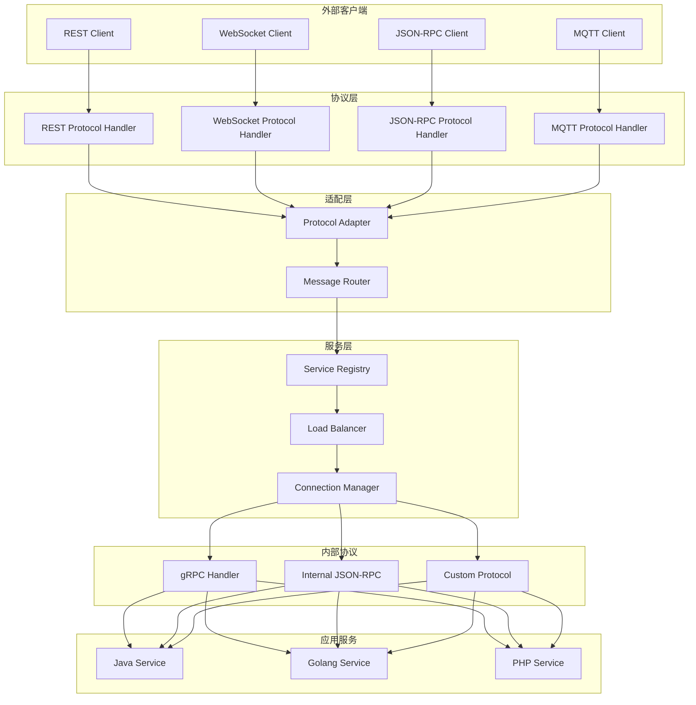

# 设计文档

## 概述

jpg3in1多语言通信框架是一个分层架构的中间件系统，旨在实现 Java、Golang、PHP 三种编程语言编写的服务之间的无缝通信。框架采用适配器模式处理多种外部协议（REST API、WebSocket、JSON-RPC 2.0、MQTT）和内部协议（gRPC、JSON-RPC、自定义协议），通过统一的抽象层屏蔽语言和协议差异。

核心设计理念：
- **语言中立**: 提供一致的 API 接口，隐藏语言实现细节
- **协议无关**: 通过适配器模式支持多种通信协议
- **可扩展性**: 支持自定义协议和序列化器的插件机制
- **高性能**: 采用异步 I/O 和连接池优化性能
- **可观测性**: 内置日志、指标和分布式追踪支持
- **复用优先**: 最大化利用成熟的开源框架和库，减少重复开发

### 现有框架复用策略

为了加快开发速度和提高系统稳定性，框架将复用以下成熟的开源组件：

**服务注册与发现**:
- 复用 **etcd** 或 **Consul** 作为服务注册中心
- 复用 **Nacos** 作为配置中心和服务发现（可选）

**内部通信协议**:
- 复用 **gRPC** 框架（Google 官方实现）
- 复用 **Protocol Buffers** 作为序列化格式
- 复用各语言的 JSON-RPC 库（如 jsonrpc4j、go-json-rpc、jsonrpc-php）

**外部协议处理**:
- Java: 复用 **Spring Boot** (REST)、**Spring WebSocket**、**Eclipse Paho** (MQTT)
- Golang: 复用 **GoFrame** 框架（集成 HTTP Server、WebSocket、gRPC 支持）
- PHP: 复用 **Hyperf** 或 **Webman/Workerman**（高性能协程框架，支持 HTTP、WebSocket、TCP）

**连接池管理**:
- Java: 复用 **HikariCP** 的设计理念，使用 **Netty** 的连接池
- Golang: 复用 **GoFrame** 的连接池管理
- PHP: 复用 **Hyperf/Webman** 内置的连接池（基于 Swoole）

**可观测性**:
- 复用 **OpenTelemetry** SDK 进行分布式追踪
- 复用 **Prometheus** 客户端库收集指标
- 复用 **Logback** (Java)、**GoFrame glog** (Go)、**Hyperf Logger** (PHP) 作为日志库

**序列化**:
- 复用 **Jackson** (Java)、**encoding/json** (Go)、**symfony/serializer** (PHP)
- 复用 **Protocol Buffers** 编译器和运行时
- 复用 **MessagePack** 库（可选高性能序列化）

**安全**:
- 复用 **JWT** 库（jjwt、golang-jwt、firebase/php-jwt）
- 复用各语言的 TLS/SSL 标准库实现

通过复用这些成熟框架，我们只需要开发：
1. 统一的抽象层和适配器
2. 协议转换逻辑
3. 跨语言的 API 一致性封装
4. 框架配置和初始化逻辑

## 架构

### 整体架构

框架采用分层架构，从下到上分为：

1. **传输层 (Transport Layer)**: 处理底层网络通信
2. **协议层 (Protocol Layer)**: 实现各种通信协议
3. **适配层 (Adapter Layer)**: 协议转换和消息路由
4. **服务层 (Service Layer)**: 服务注册、发现和调用
5. **应用层 (Application Layer)**: 语言特定的 SDK 接口



### 数据流

1. **外部请求流程**:
   - 客户端通过外部协议发送请求
   - 协议处理器解析请求
   - 协议适配器转换为内部格式
   - 消息路由器查询服务注册中心
   - 负载均衡器选择目标服务实例
   - 连接管理器建立或复用连接
   - 通过内部协议发送到目标服务
   - 响应沿相反路径返回

2. **服务间通信流程**:
   - 服务 A 调用框架 SDK
   - SDK 查询服务注册中心获取服务 B 地址
   - 通过内部协议直接通信
   - 无需协议转换（可选优化）

## 组件和接口

### 1. 语言 SDK 接口

每种语言的 SDK 提供统一的抽象接口：

**Java SDK 接口**:
```java
public interface FrameworkClient {
    // 同步调用
    <T> T call(String service, String method, Object request, Class<T> responseType);
    
    // 异步调用
    <T> CompletableFuture<T> callAsync(String service, String method, Object request, Class<T> responseType);
    
    // 流式调用
    <T> Stream<T> stream(String service, String method, Object request, Class<T> responseType);
    
    // 注册服务
    void registerService(String name, Object implementation);
    
    // 启动和关闭
    void start();
    void shutdown();
}
```

**Golang SDK 接口**:
```go
type FrameworkClient interface {
    // 同步调用
    Call(ctx context.Context, service, method string, request interface{}, response interface{}) error
    
    // 异步调用
    CallAsync(ctx context.Context, service, method string, request interface{}) (<-chan Response, error)
    
    // 流式调用
    Stream(ctx context.Context, service, method string, request interface{}) (<-chan interface{}, error)
    
    // 注册服务
    RegisterService(name string, handler ServiceHandler) error
    
    // 启动和关闭
    Start() error
    Shutdown(ctx context.Context) error
}
```

**PHP SDK 接口**:
```php
interface FrameworkClient {
    // 同步调用
    public function call(string $service, string $method, $request): mixed;
    
    // 异步调用（使用 Promise）
    public function callAsync(string $service, string $method, $request): PromiseInterface;
    
    // 注册服务
    public function registerService(string $name, callable $handler): void;
    
    // 启动和关闭
    public function start(): void;
    public function shutdown(): void;
}
```

### 2. 协议适配器

协议适配器负责外部协议和内部协议之间的转换：

```typescript
interface ProtocolAdapter {
    // 外部协议转内部协议
    transformRequest(externalRequest: ExternalRequest): InternalRequest;
    
    // 内部协议转外部协议
    transformResponse(internalResponse: InternalResponse): ExternalResponse;
    
    // 获取支持的协议类型
    getSupportedProtocols(): ProtocolType[];
}

interface ExternalRequest {
    protocol: 'REST' | 'WebSocket' | 'JSON-RPC' | 'MQTT';
    headers: Map<string, string>;
    body: any;
    metadata: RequestMetadata;
}

interface InternalRequest {
    service: string;
    method: string;
    payload: Buffer;
    headers: Map<string, string>;
    traceId: string;
    timeout: number;
}
```

### 3. 消息路由器

消息路由器根据服务名称和路由规则确定目标服务：

```typescript
interface MessageRouter {
    // 路由消息到目标服务
    route(request: InternalRequest): ServiceEndpoint;
    
    // 注册路由规则
    registerRule(rule: RoutingRule): void;
    
    // 更新路由表
    updateRoutingTable(services: ServiceInfo[]): void;
}

interface RoutingRule {
    matcher: (request: InternalRequest) => boolean;
    target: string | ((request: InternalRequest) => string);
    priority: number;
}

interface ServiceEndpoint {
    serviceId: string;
    address: string;
    port: number;
    protocol: InternalProtocol;
    metadata: Map<string, string>;
}
```

### 4. 服务注册中心

服务注册中心管理服务的注册、发现和健康检查：

```typescript
interface ServiceRegistry {
    // 注册服务
    register(service: ServiceInfo): Promise<void>;
    
    // 注销服务
    deregister(serviceId: string): Promise<void>;
    
    // 查询服务
    discover(serviceName: string): Promise<ServiceInfo[]>;
    
    // 健康检查
    healthCheck(serviceId: string): Promise<HealthStatus>;
    
    // 监听服务变化
    watch(serviceName: string, callback: (services: ServiceInfo[]) => void): void;
}

interface ServiceInfo {
    id: string;
    name: string;
    version: string;
    language: 'java' | 'golang' | 'php';
    address: string;
    port: number;
    protocols: InternalProtocol[];
    metadata: Map<string, string>;
    registeredAt: Date;
}
```

### 5. 连接管理器

连接管理器维护连接池并管理连接生命周期：

```typescript
interface ConnectionManager {
    // 获取连接
    getConnection(endpoint: ServiceEndpoint): Promise<Connection>;
    
    // 释放连接
    releaseConnection(connection: Connection): void;
    
    // 关闭所有连接
    closeAll(): Promise<void>;
    
    // 配置连接池
    configure(config: PoolConfig): void;
}

interface Connection {
    id: string;
    endpoint: ServiceEndpoint;
    state: 'idle' | 'active' | 'closed';
    createdAt: Date;
    lastUsedAt: Date;
    
    // 发送请求
    send(request: InternalRequest): Promise<InternalResponse>;
    
    // 关闭连接
    close(): Promise<void>;
}

interface PoolConfig {
    maxConnections: number;
    minConnections: number;
    idleTimeout: number;
    maxLifetime: number;
    connectionTimeout: number;
}
```

### 6. 序列化器

序列化器处理不同语言和协议之间的数据转换：

```typescript
interface Serializer {
    // 序列化
    serialize(data: any, targetFormat: SerializationFormat): Buffer;
    
    // 反序列化
    deserialize(buffer: Buffer, sourceFormat: SerializationFormat, targetType: Type): any;
    
    // 获取支持的格式
    getSupportedFormats(): SerializationFormat[];
}

type SerializationFormat = 'json' | 'protobuf' | 'msgpack' | 'custom';

interface Type {
    name: string;
    fields: Field[];
}

interface Field {
    name: string;
    type: string;
    optional: boolean;
}
```

## 数据模型

### 消息模型

所有通信都基于统一的消息模型：

```typescript
interface Message {
    id: string;              // 消息唯一标识
    type: MessageType;       // 消息类型
    timestamp: number;       // 时间戳
    traceId: string;         // 追踪 ID
    spanId: string;          // 跨度 ID
    source: ServiceInfo;     // 源服务
    destination: ServiceInfo; // 目标服务
    payload: Buffer;         // 消息负载
    headers: Map<string, string>; // 消息头
    metadata: MessageMetadata;    // 元数据
}

type MessageType = 
    | 'request'      // 请求
    | 'response'     // 响应
    | 'error'        // 错误
    | 'event'        // 事件
    | 'stream_start' // 流开始
    | 'stream_data'  // 流数据
    | 'stream_end';  // 流结束

interface MessageMetadata {
    protocol: string;        // 协议类型
    encoding: string;        // 编码格式
    compression: string;     // 压缩算法
    timeout: number;         // 超时时间
    retryCount: number;      // 重试次数
    priority: number;        // 优先级
}
```

### 错误模型

统一的错误模型用于跨语言和协议的错误传播：

```typescript
interface FrameworkError {
    code: ErrorCode;         // 错误码
    message: string;         // 错误消息
    details: any;            // 详细信息
    cause?: FrameworkError;  // 原因错误（错误链）
    stackTrace: string[];    // 堆栈追踪
    timestamp: number;       // 发生时间
    serviceId: string;       // 发生服务
}

enum ErrorCode {
    // 客户端错误 (4xx)
    BAD_REQUEST = 400,
    UNAUTHORIZED = 401,
    FORBIDDEN = 403,
    NOT_FOUND = 404,
    TIMEOUT = 408,
    
    // 服务端错误 (5xx)
    INTERNAL_ERROR = 500,
    NOT_IMPLEMENTED = 501,
    SERVICE_UNAVAILABLE = 503,
    
    // 框架错误 (6xx)
    PROTOCOL_ERROR = 600,
    SERIALIZATION_ERROR = 601,
    ROUTING_ERROR = 602,
    CONNECTION_ERROR = 603,
}
```

### 配置模型

框架配置采用分层结构：

```typescript
interface FrameworkConfig {
    // 基础配置
    name: string;
    version: string;
    language: 'java' | 'golang' | 'php';
    
    // 网络配置
    network: NetworkConfig;
    
    // 协议配置
    protocols: ProtocolConfig;
    
    // 服务注册配置
    registry: RegistryConfig;
    
    // 连接池配置
    connectionPool: PoolConfig;
    
    // 安全配置
    security: SecurityConfig;
    
    // 可观测性配置
    observability: ObservabilityConfig;
}

interface NetworkConfig {
    host: string;
    port: number;
    maxConnections: number;
    readTimeout: number;
    writeTimeout: number;
    keepAlive: boolean;
}

interface ProtocolConfig {
    external: ExternalProtocolConfig[];
    internal: InternalProtocolConfig[];
}

interface ExternalProtocolConfig {
    type: 'REST' | 'WebSocket' | 'JSON-RPC' | 'MQTT';
    enabled: boolean;
    port: number;
    path?: string;
    options: Map<string, any>;
}

interface InternalProtocolConfig {
    type: 'gRPC' | 'JSON-RPC' | 'Custom';
    enabled: boolean;
    serialization: SerializationFormat;
    compression: boolean;
}

interface RegistryConfig {
    type: 'etcd' | 'consul' | 'zookeeper' | 'redis';
    endpoints: string[];
    namespace: string;
    ttl: number;
    heartbeatInterval: number;
}

interface SecurityConfig {
    tls: {
        enabled: boolean;
        certFile: string;
        keyFile: string;
        caFile: string;
    };
    authentication: {
        enabled: boolean;
        type: 'jwt' | 'apikey' | 'oauth2';
        options: Map<string, any>;
    };
    authorization: {
        enabled: boolean;
        type: 'rbac' | 'acl';
        rules: AuthorizationRule[];
    };
}

interface ObservabilityConfig {
    logging: {
        level: 'debug' | 'info' | 'warn' | 'error';
        format: 'json' | 'text';
        output: string;
    };
    metrics: {
        enabled: boolean;
        port: number;
        path: string;
    };
    tracing: {
        enabled: boolean;
        exporter: 'jaeger' | 'zipkin' | 'otlp';
        endpoint: string;
        samplingRate: number;
    };
}
```


## 正确性属性

属性是一种特征或行为，应该在系统的所有有效执行中保持为真——本质上是关于系统应该做什么的形式化陈述。属性作为人类可读规范和机器可验证正确性保证之间的桥梁。

### 属性 1: 跨语言 API 一致性

*对于任意*消息和服务调用，使用不同语言的 SDK（Java、Golang、PHP）发送相同的请求应该得到等价的响应

**验证需求: 1.4**

### 属性 2: 跨语言数据类型往返一致性

*对于任意*数据对象，在一种语言中序列化后在另一种语言中反序列化，应该得到语义等价的数据

**验证需求: 1.5**

### 属性 3: 外部协议处理完整性

*对于任意*有效的外部协议请求（REST、WebSocket、JSON-RPC、MQTT），框架应该能够正确解析、处理并返回符合协议规范的响应

**验证需求: 2.1, 2.2, 2.3, 2.4**

### 属性 4: HTTP 方法支持完整性

*对于任意*标准 HTTP 方法（GET、POST、PUT、DELETE、PATCH），框架应该能够正确处理该方法的请求

**验证需求: 2.5**

### 属性 5: WebSocket 消息格式支持

*对于任意*WebSocket 消息（文本或二进制），框架应该能够正确接收和处理

**验证需求: 2.6**

### 属性 6: 内部协议通信支持

*对于任意*内部协议（gRPC、JSON-RPC、自定义协议），服务间应该能够成功通信

**验证需求: 3.1, 3.2, 3.3**

### 属性 7: 序列化往返一致性

*对于任意*数据对象和序列化格式（JSON、Protobuf、自定义），序列化后反序列化应该得到等价的对象

**验证需求: 3.4, 3.5, 6.6**

### 属性 8: 自定义序列化器扩展性

*对于任意*自定义序列化器，注册后应该能够正确序列化和反序列化对应类型的数据

**验证需求: 3.6**

### 属性 9: 协议转换往返一致性

*对于任意*外部协议消息，转换为内部协议再转换回外部协议应该保持语义等价性

**验证需求: 4.1, 4.2**

### 属性 10: 消息路由正确性

*对于任意*服务名称和方法名，消息路由器应该返回正确的目标服务端点

**验证需求: 4.3**

### 属性 11: 协议语义一致性

*对于任意*消息类型（请求/响应、发布/订阅），协议转换前后消息的语义类型应该保持一致

**验证需求: 4.5**

### 属性 12: 基于内容的路由规则

*对于任意*路由规则和消息，当消息匹配规则时，应该被路由到规则指定的目标服务

**验证需求: 4.6**

### 属性 13: 服务注册可发现性

*对于任意*服务，启动并注册后，应该能够通过服务注册中心查询到该服务的元数据

**验证需求: 5.1**

### 属性 14: 服务注销不可见性

*对于任意*已注册服务，注销后，服务注册中心不应该再返回该服务

**验证需求: 5.2**

### 属性 15: 服务发现返回可用实例

*对于任意*服务查询，服务注册中心应该只返回已注册且健康的服务实例

**验证需求: 5.3**

### 属性 16: 服务健康状态同步

*对于任意*服务，当其健康状态变化时，服务注册中心应该反映最新的健康状态

**验证需求: 5.4**

### 属性 17: 服务版本管理

*对于任意*服务的多个版本，应该能够独立注册、查询和调用不同版本

**验证需求: 5.5**

### 属性 18: 负载均衡策略一致性

*对于任意*负载均衡策略（轮询、随机、最少连接），服务选择应该符合该策略的分布特征

**验证需求: 5.6**

### 属性 19: 基本数据类型序列化支持

*对于任意*基本数据类型（整数、浮点数、字符串、布尔值），应该能够正确序列化和反序列化

**验证需求: 6.3**

### 属性 20: 复合数据类型序列化支持

*对于任意*复合数据类型（数组、对象、映射），应该能够正确序列化和反序列化

**验证需求: 6.4**

### 属性 21: 自定义类型序列化扩展

*对于任意*自定义类型，注册序列化器后，应该能够正确序列化和反序列化该类型的实例

**验证需求: 6.5**

### 属性 22: 连接复用

*对于任意*连续的多个请求到同一服务端点，应该能够复用同一网络连接

**验证需求: 7.1, 12.2**

### 属性 23: 连接空闲超时关闭

*对于任意*连接，如果空闲时间超过配置的超时时间，应该被自动关闭

**验证需求: 7.2**

### 属性 24: 连接失败重连

*对于任意*连接失败，连接管理器应该根据重连策略尝试重新建立连接

**验证需求: 7.3**

### 属性 25: 连接健康监控

*对于任意*连接，应该能够查询其当前的健康状态

**验证需求: 7.4**

### 属性 26: 连接优雅关闭

*对于任意*连接，关闭时应该等待所有进行中的请求完成后再关闭

**验证需求: 7.5**

### 属性 27: 协议错误标准化响应

*对于任意*协议错误，框架应该返回符合标准格式的错误响应，包含错误码和错误消息

**验证需求: 8.1**

### 属性 28: 序列化错误处理

*对于任意*序列化错误，框架应该记录详细错误信息并返回明确的错误码

**验证需求: 8.2**

### 属性 29: 请求超时取消

*对于任意*请求，如果执行时间超过配置的超时时间，应该被取消并返回超时错误

**验证需求: 8.3**

### 属性 30: 网络中断处理

*对于任意*网络连接中断，框架应该尝试重连或返回明确的连接错误

**验证需求: 8.4**

### 属性 31: 错误码统一映射

*对于任意*协议特定的错误，应该能够映射到框架统一的错误码

**验证需求: 8.5**

### 属性 32: 错误链式追踪

*对于任意*跨服务调用产生的错误，错误对象应该包含完整的调用链和原因链

**验证需求: 8.6**

### 属性 33: 环境变量配置覆盖

*对于任意*配置项，如果同时存在配置文件和环境变量，环境变量的值应该生效

**验证需求: 9.2**

### 属性 34: 运行时配置动态更新

*对于任意*支持动态更新的配置项，运行时更新后应该立即生效

**验证需求: 9.3**

### 属性 35: 配置验证

*对于任意*无效配置，框架应该在启动时检测并报告明确的错误信息

**验证需求: 9.4**

### 属性 36: 敏感配置加密存储

*对于任意*敏感配置（密钥、密码），应该能够以加密形式存储和读取

**验证需求: 9.6**

### 属性 37: 请求响应日志记录

*对于任意*请求和响应，应该有对应的日志记录

**验证需求: 10.1**

### 属性 38: 性能指标收集

*对于任意*请求，应该收集其性能指标（延迟、吞吐量、错误率）

**验证需求: 10.2**

### 属性 39: 分布式追踪支持

*对于任意*跨服务请求，应该包含分布式追踪信息（trace ID、span ID）

**验证需求: 10.3**

### 属性 40: 日志上下文完整性

*对于任意*日志记录，应该包含请求 ID、时间戳、服务名称等必要的上下文信息

**验证需求: 10.5**

### 属性 41: 日志级别动态调整

*对于任意*日志级别变更，应该能够在运行时生效，影响后续的日志输出

**验证需求: 10.6**

### 属性 42: TLS 加密通信

*对于任意*启用 TLS 的连接，传输的数据应该是加密的

**验证需求: 11.1**

### 属性 43: 令牌认证

*对于任意*请求，有效的认证令牌应该通过认证，无效令牌应该被拒绝

**验证需求: 11.2**

### 属性 44: 基于角色的访问控制

*对于任意*请求和资源，只有具有相应角色权限的用户才能访问

**验证需求: 11.3**

### 属性 45: API 密钥认证

*对于任意*请求，有效的 API 密钥应该通过认证，无效密钥应该被拒绝

**验证需求: 11.6**

### 属性 46: 异步非阻塞 I/O

*对于任意*I/O 操作，不应该阻塞调用线程，应该能够并发处理多个请求

**验证需求: 12.1**

### 属性 47: 服务水平扩展

*对于任意*服务，部署多个实例后，请求应该能够分布到不同实例

**验证需求: 12.3**

### 属性 48: 负载均衡策略分布

*对于任意*负载均衡策略和多个服务实例，请求分布应该符合策略的预期分布

**验证需求: 12.4**

### 属性 49: 背压机制

*对于任意*系统过载情况，背压机制应该能够限制请求速率，防止系统崩溃

**验证需求: 12.6**

## 错误处理

### 错误分类

框架定义了三类错误：

1. **客户端错误 (4xx)**: 由客户端请求问题引起
   - 400 Bad Request: 请求格式错误
   - 401 Unauthorized: 认证失败
   - 403 Forbidden: 授权失败
   - 404 Not Found: 服务或资源不存在
   - 408 Timeout: 请求超时

2. **服务端错误 (5xx)**: 由服务端问题引起
   - 500 Internal Error: 内部错误
   - 501 Not Implemented: 功能未实现
   - 503 Service Unavailable: 服务不可用

3. **框架错误 (6xx)**: 由框架层问题引起
   - 600 Protocol Error: 协议错误
   - 601 Serialization Error: 序列化错误
   - 602 Routing Error: 路由错误
   - 603 Connection Error: 连接错误

### 错误处理策略

1. **错误传播**: 错误应该包含完整的调用链和原因链
2. **错误转换**: 不同协议的错误应该映射到统一的错误模型
3. **错误恢复**: 对于可恢复的错误（如网络中断），应该实施重试策略
4. **错误日志**: 所有错误都应该记录详细的日志，包括堆栈追踪
5. **错误监控**: 错误率应该作为关键指标进行监控和告警

### 重试策略

框架实施指数退避重试策略：

```typescript
interface RetryPolicy {
    maxAttempts: number;        // 最大重试次数
    initialDelay: number;       // 初始延迟（毫秒）
    maxDelay: number;           // 最大延迟（毫秒）
    multiplier: number;         // 延迟倍数
    retryableErrors: ErrorCode[]; // 可重试的错误码
}

// 默认重试策略
const defaultRetryPolicy: RetryPolicy = {
    maxAttempts: 3,
    initialDelay: 100,
    maxDelay: 5000,
    multiplier: 2,
    retryableErrors: [
        ErrorCode.TIMEOUT,
        ErrorCode.SERVICE_UNAVAILABLE,
        ErrorCode.CONNECTION_ERROR
    ]
};
```

### 熔断器模式

为防止级联失败，框架实施熔断器模式：

```typescript
interface CircuitBreaker {
    state: 'closed' | 'open' | 'half-open';
    failureThreshold: number;    // 失败阈值
    successThreshold: number;    // 成功阈值（半开状态）
    timeout: number;             // 熔断超时时间
    
    // 记录调用结果
    recordSuccess(): void;
    recordFailure(): void;
    
    // 检查是否允许请求
    allowRequest(): boolean;
}
```

熔断器状态转换：
- **Closed**: 正常状态，允许所有请求
- **Open**: 熔断状态，拒绝所有请求
- **Half-Open**: 半开状态，允许少量请求测试服务是否恢复

## 测试策略

### 双重测试方法

框架采用单元测试和基于属性的测试相结合的方法：

1. **单元测试**: 验证特定示例、边缘情况和错误条件
   - 特定协议的请求/响应示例
   - 边缘情况（空输入、最大值、特殊字符）
   - 错误条件（无效输入、网络故障、超时）
   - 组件间的集成点

2. **基于属性的测试**: 验证所有输入的通用属性
   - 序列化往返一致性
   - 协议转换语义保持
   - 跨语言 API 一致性
   - 负载均衡分布特征
   - 错误处理完整性

### 基于属性的测试配置

**测试库选择**:
- Java: jqwik
- Golang: gopter
- PHP: Eris

**测试配置**:
- 每个属性测试最少运行 100 次迭代
- 每个测试必须引用设计文档中的属性
- 标签格式: **Feature: multi-language-communication-framework, Property {number}: {property_text}**

**示例（Java）**:
```java
@Property
@Label("Feature: multi-language-communication-framework, Property 7: 序列化往返一致性")
void serializationRoundTrip(@ForAll Object data) {
    Buffer serialized = serializer.serialize(data, SerializationFormat.JSON);
    Object deserialized = serializer.deserialize(serialized, SerializationFormat.JSON, data.getClass());
    assertEquals(data, deserialized);
}
```

**示例（Golang）**:
```go
// Feature: multi-language-communication-framework, Property 7: 序列化往返一致性
func TestSerializationRoundTrip(t *testing.T) {
    properties := gopter.NewProperties(nil)
    properties.Property("serialization round trip", prop.ForAll(
        func(data interface{}) bool {
            serialized := serializer.Serialize(data, JSON)
            deserialized := serializer.Deserialize(serialized, JSON, reflect.TypeOf(data))
            return reflect.DeepEqual(data, deserialized)
        },
        gen.AnyVal(),
    ))
    properties.TestingRun(t, gopter.ConsoleReporter(false))
}
```

**示例（PHP）**:
```php
// Feature: multi-language-communication-framework, Property 7: 序列化往返一致性
test('serialization round trip', function () {
    $this->forAll(Generator::any())
        ->then(function ($data) {
            $serialized = $this->serializer->serialize($data, SerializationFormat::JSON);
            $deserialized = $this->serializer->deserialize($serialized, SerializationFormat::JSON, get_class($data));
            $this->assertEquals($data, $deserialized);
        })
        ->runs(100);
});
```

### 测试覆盖范围

1. **协议测试**:
   - 所有外部协议的请求/响应处理
   - 所有内部协议的服务间通信
   - 协议转换的正确性和性能

2. **跨语言测试**:
   - Java、Golang、PHP 之间的互操作性
   - 数据类型映射的正确性
   - API 接口的一致性

3. **性能测试**:
   - 高并发场景下的吞吐量和延迟
   - 连接池的效率
   - 序列化/反序列化的性能

4. **容错测试**:
   - 网络故障恢复
   - 服务不可用处理
   - 超时和重试机制

5. **安全测试**:
   - 认证和授权机制
   - TLS 加密通信
   - 敏感数据保护

### 集成测试环境

集成测试需要搭建完整的测试环境：

1. **服务注册中心**: 使用 etcd 或 consul 的测试实例
2. **多语言服务**: 部署 Java、Golang、PHP 的测试服务
3. **协议端点**: 启动所有外部协议的监听端点
4. **监控系统**: 配置日志、指标和追踪收集

### 持续集成

测试应该集成到 CI/CD 流程中：

1. **代码提交**: 运行单元测试和快速属性测试（10 次迭代）
2. **合并请求**: 运行完整属性测试（100 次迭代）和集成测试
3. **发布前**: 运行性能测试和压力测试
4. **生产监控**: 持续监控错误率和性能指标
