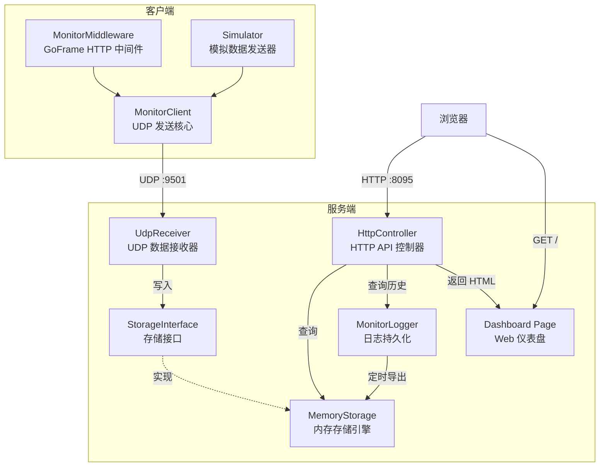

# API 性能监控系统 - Golang 版

基于 UDP 传输的 API 性能监控系统 Golang 完整实现，包含**客户端**（GoFrame HTTP 中间件 + UDP 发送核心）和**服务端**（UDP 接收 + 内存存储 + 日志持久化 + HTTP API + Web 仪表盘）。

与 PHP 版（`examples/api-monitor/php/`）功能完全对标，API 接口和数据格式完全兼容，前端仪表盘页面直接复用。无需 PHP 运行环境，纯 Golang 实现，开箱即用。

## 功能特性

- 单个接口单次访问耗时记录
- 单个接口每分钟/每小时/每天访问次数统计
- 成功次数、失败次数、成功率
- 所有接口慢速排行
- 所有接口访问次数排行
- 实时接口访问量（最近 10 分钟）
- 全天访问趋势（1440 个分钟级数据点）
- 左侧菜单：按项目 → 类 → 方法分类
- 右上角：接口与日期查询，支持前后 7 天快捷切换
- 日志持久化：定时将统计数据导出为 JSON 文件长期保存
- 历史数据查看：进程重启后自动从日志文件读取历史数据
- 访问密码保护：支持仪表盘登录验证
- GoFrame HTTP 中间件：一行代码接入监控

## 架构图



### 数据流

```
GoFrame 应用 / Simulator
    │
    ▼ Report(class, method, uri, status, duration)
MonitorClient
    │ 采样率过滤 + Buffer 批量发送
    ▼ UDP（\n 分隔的 JSON）
UdpReceiver
    │ 逐行解析 JSON
    ▼ Record(data)
MemoryStorage
    │ 分钟/小时/天三级聚合
    │
    ├──→ MonitorLogger（每 60 秒导出 JSON 文件，按 sessionId 分槽）
    │
    └──→ HttpController（合并内存实时数据 + 日志历史数据）
              │
              ▼
         浏览器 Web 仪表盘
```

## 端口分配

| 服务 | 端口 | 协议 | 说明 |
|------|------|------|------|
| 监控服务端 UDP | 9501 | UDP | 接收客户端发送的性能数据 |
| 监控服务端 HTTP | 8095 | HTTP | Web 仪表盘 + API 接口 |

## 目录结构

```
examples/api-monitor/golang/
├── cmd/
│   ├── server/
│   │   └── main.go              # 服务端 main 入口
│   └── simulator/
│       └── main.go              # 模拟客户端 main 入口
├── internal/
│   ├── client/
│   │   ├── monitor_client.go    # MonitorClient UDP 发送核心
│   │   └── middleware.go        # MonitorMiddleware GoFrame 中间件
│   └── server/
│       ├── storage.go           # StorageInterface 存储接口 + 数据模型定义
│       ├── memory_storage.go    # MemoryStorage 内存存储引擎
│       ├── monitor_logger.go    # MonitorLogger 日志持久化
│       ├── udp_receiver.go      # UdpReceiver UDP 数据接收器
│       └── http_controller.go   # HttpController HTTP API 控制器
├── public/
│   └── index.html               # Web 仪表盘前端页面（复用 PHP 版）
├── config.yaml                  # YAML 配置文件
├── go.mod                       # Go Module 定义
├── go.sum
├── run-all.sh                   # Linux 一键启动脚本
├── run-all.bat                  # Windows 一键启动脚本
└── README.md                    # 本文档
```

## 快速开始

### 前置条件

- Go >= 1.21
- 已执行 `go mod tidy`（在 `examples/api-monitor/golang/` 目录下）

### 方式一：一键启动

一键脚本会自动编译服务端和模拟客户端，然后依次启动。

**Linux / macOS：**

```bash
chmod +x examples/api-monitor/golang/run-all.sh
examples/api-monitor/golang/run-all.sh
```

**Windows：**

```bat
examples\api-monitor\golang\run-all.bat
```

脚本执行流程：
1. 编译服务端（`cmd/server/`）为可执行文件
2. 编译模拟客户端（`cmd/simulator/`）为可执行文件
3. 启动服务端
4. 等待 3 秒
5. 启动模拟客户端
6. 输出仪表盘访问地址：http://localhost:8095

Linux 下按 `Ctrl+C` 停止所有服务；Windows 下关闭对应窗口即可停止。

### 方式二：手动启动

**1. 编译**

```bash
cd examples/api-monitor/golang

# 编译服务端
go build -o server ./cmd/server/

# 编译模拟客户端
go build -o simulator ./cmd/simulator/
```

Windows 下编译产物为 `server.exe` 和 `simulator.exe`。

**2. 启动服务端**

```bash
# Linux
./server

# Windows
server.exe
```

**3. 启动模拟客户端（可选，用于测试）**

```bash
# Linux
./simulator

# Windows
simulator.exe
```

**4. 访问仪表盘**

浏览器打开 http://localhost:8095

默认密码：`888888`（可在 `config.yaml` 中修改或设为空以禁用密码）

## GoFrame 应用接入

在你的 GoFrame 应用中接入 MonitorMiddleware，只需几行代码即可自动采集所有 HTTP 请求的性能数据。

### 1. 创建 MonitorClient 并注册中间件

```go
package main

import (
    "api-monitor-golang/internal/client"

    "github.com/gogf/gf/v2/frame/g"
    "github.com/gogf/gf/v2/net/ghttp"
)

func main() {
    s := g.Server()

    // 创建 MonitorClient
    // 参数：UDP 地址、端口、项目名、采样率、缓冲区大小
    mc := client.NewMonitorClient("127.0.0.1", 9501, "my-project", 1.0, 10)
    defer mc.Close()

    // 注册监控中间件
    // 参数：MonitorClient 实例、排除路径列表、是否启用
    middleware := client.NewMonitorMiddleware(mc, []string{"/health", "/favicon.ico"}, true)
    s.Use(middleware)

    // 注册你的业务路由
    s.BindHandler("GET:/api/users", func(r *ghttp.Request) {
        r.Response.WriteJson(g.Map{"users": []string{"alice", "bob"}})
    })

    s.BindHandler("GET:/api/orders", func(r *ghttp.Request) {
        r.Response.WriteJson(g.Map{"orders": []string{}})
    })

    s.SetPort(8080)
    s.Run()
}
```

### 2. 中间件行为说明

- 自动记录每个 HTTP 请求的耗时（毫秒）、状态码、URI
- 从 URI 路径自动解析控制器名（首字母大写 + Controller 后缀）和方法名
- 匹配 `exclude` 列表的路径不采集（前缀匹配）
- `enabled` 为 `false` 时直接放行，不执行任何监控逻辑
- 采样率控制：`sampleRate` 设为 `0.5` 表示只采集 50% 的请求
- 缓冲区：累积 `bufferSize` 条记录后批量 UDP 发送，减少网络开销
- UDP 发送失败静默忽略，不影响业务请求

### 3. 手动上报

如果需要在非 HTTP 中间件场景下手动上报数据：

```go
// 手动上报一条监控数据
mc.Report(
    "UserController",  // class - 控制器名
    "getList",         // method - 方法名
    "/api/users",      // uri - 请求路径
    200,               // status - HTTP 状态码
    35.6,              // duration - 耗时（毫秒）
    map[string]interface{}{"page": 1},           // params（可选，传 nil 则不包含）
    map[string]interface{}{"code": 0, "msg": "ok"}, // response（可选，传 nil 则不包含）
)

// 立即发送缓冲区中的数据
mc.Flush()
```

## 配置说明

配置文件为项目根目录下的 `config.yaml`，包含客户端和服务端两部分配置。

```yaml
# ============================================================
# 客户端配置 - 控制数据采集和发送行为
# ============================================================
monitor:
  # 是否启用监控采集
  enabled: true

  # 监控服务端 UDP 地址
  udp_host: "127.0.0.1"

  # 监控服务端 UDP 端口
  udp_port: 9501

  # 项目名称（用于区分不同项目的监控数据）
  project: "demo-project"

  # 采样率 0.0~1.0（1.0 = 100% 采集，0.5 = 50% 采集）
  sample_rate: 1.0

  # 缓冲区大小（累积多少条记录后批量发送，减少 UDP 包数量）
  buffer_size: 10

  # 排除的路径列表（匹配的请求不进行数据采集）
  exclude:
    - "/health"
    - "/favicon.ico"

# ============================================================
# 服务端配置 - 控制数据接收、存储和展示行为
# ============================================================
server:
  # HTTP 服务端口（Web 仪表盘和 API 接口）
  http_port: 8095

  # UDP 监听端口（接收客户端发送的监控数据）
  udp_port: 9501

  # 存储驱动（目前仅支持 memory，无外部依赖）
  storage_driver: "memory"

  # 仪表盘访问密码（为空则不需要密码）
  password: "888888"

  # 日志持久化配置
  log:
    # 是否启用日志持久化（定时将内存数据导出为 JSON 文件）
    enable: true

    # 导出间隔（秒），默认每 60 秒导出一次
    interval: 60
```

### 配置项说明

#### 客户端配置（monitor）

| 配置项 | 类型 | 默认值 | 说明 |
|--------|------|--------|------|
| `enabled` | bool | `true` | 是否启用监控采集 |
| `udp_host` | string | `127.0.0.1` | 监控服务端 UDP 地址 |
| `udp_port` | int | `9501` | 监控服务端 UDP 端口 |
| `project` | string | `demo-project` | 项目名称，用于区分不同项目 |
| `sample_rate` | float | `1.0` | 采样率，0.0~1.0 |
| `buffer_size` | int | `10` | 缓冲区大小，累积后批量发送 |
| `exclude` | []string | `["/health", "/favicon.ico"]` | 排除路径列表，前缀匹配 |

#### 服务端配置（server）

| 配置项 | 类型 | 默认值 | 说明 |
|--------|------|--------|------|
| `http_port` | int | `8095` | HTTP 服务端口（仪表盘 + API） |
| `udp_port` | int | `9501` | UDP 监听端口（接收监控数据） |
| `storage_driver` | string | `memory` | 存储驱动，目前仅支持 `memory` |
| `password` | string | `888888` | 仪表盘访问密码，为空则不需要密码 |
| `log.enable` | bool | `true` | 是否启用日志持久化 |
| `log.interval` | int | `60` | 日志导出间隔（秒） |

### 访问密码

- 设置密码后，访问仪表盘需要先输入密码，验证通过后通过 cookie 保持登录 30 天
- 设置为空字符串 `""` 则不需要密码，任何人都可以直接访问
- 登录凭证使用 `md5(password + "_monitor_salt")` 算法，与 PHP 版兼容

### 内存存储模式

- 无外部依赖，开箱即用
- 按分钟/小时/天三级聚合统计数据
- 每个接口每分钟最多保留 200 条访问明细
- 自动清理超过 2 小时的明细记录
- 进程重启后内存数据丢失（建议开启日志持久化）

### 日志持久化

开启后，定时将统计数据导出为 JSON 文件，保存在 `runtime/logs/monitor/` 目录：

```
runtime/logs/monitor/
  2025-01-15.json            # 天级汇总（仪表盘、排行榜、树形结构）
  2025-01-15_minute.json     # 分钟级明细（分时统计 + 访问明细记录）
```

使用 sessionId 分槽存储机制，每次进程启动生成唯一 sessionId，确保：
- 重启后历史数据不丢失
- 多次运行的数据互不干扰
- 查询时自动合并内存实时数据与日志历史数据

## API 接口列表

所有 API 接口与 PHP 版完全兼容，返回统一 JSON 格式：`{"code": 0, "data": ...}`。

### 仪表盘页面

| 接口 | 方法 | 说明 |
|------|------|------|
| `/` | GET | Web 仪表盘页面（返回 HTML） |

### 数据查询接口

| 接口 | 方法 | 参数 | 说明 |
|------|------|------|------|
| `/api/dashboard` | GET | `date`（可选，默认今天） | 仪表盘概览：总访问量、成功/失败数、成功率、平均耗时 |
| `/api/tree` | GET | `date`（可选） | 树形菜单：项目 → 类 → 方法的层级结构 |
| `/api/detail` | GET | `project`、`class`、`method`、`date`（默认今天）、`granularity`（minute/hour/day，默认 minute） | 接口详情：指定接口在指定日期按指定粒度的统计数据 |
| `/api/ranking/slow` | GET | `date`（默认今天）、`limit`（默认 50） | 慢速排行：按平均耗时降序排列的接口列表 |
| `/api/ranking/count` | GET | `date`（默认今天）、`limit`（默认 50） | 访问量排行：按访问次数降序排列的接口列表 |
| `/api/realtime` | GET | 无 | 实时访问量：最近 10 分钟每分钟的访问统计 |
| `/api/trend` | GET | `date`（默认今天） | 全天访问趋势：1440 个分钟级数据点 |
| `/api/search` | GET | `keyword`、`date`（默认今天） | 搜索接口：大小写不敏感匹配 project、class、method、uri |
| `/api/dates` | GET | 无 | 可用日期列表：前后 7 天，标注是否有数据及来源（memory/log） |
| `/api/records` | GET | `project`、`class`、`method`、`minute`、`limit`（默认 100） | 访问明细：指定接口在指定分钟的详细访问记录 |

### 登录验证接口

| 接口 | 方法 | 参数 | 说明 |
|------|------|------|------|
| `/api/login` | POST | `password`（表单或查询参数） | 登录验证：密码正确时通过 Set-Cookie 写入 `monitor_token`，有效期 30 天 |
| `/api/check-login` | GET | 无（读取 cookie） | 检查登录状态：返回 `{"need_login": true/false}` |

### 接口响应格式

**成功响应：**

```json
{
  "code": 0,
  "data": { ... }
}
```

**登录失败响应：**

```json
{
  "code": 1,
  "data": {
    "ok": false,
    "msg": "密码错误"
  }
}
```

### 接口详情参数说明

#### `/api/dashboard` 响应示例

```json
{
  "code": 0,
  "data": {
    "date": "2025-01-15",
    "total_count": 1500,
    "success": 1420,
    "fail": 80,
    "success_rate": 94.67,
    "avg_time": 45.32
  }
}
```

#### `/api/detail` 粒度参数

| 粒度 | 值 | 时间格式 | 说明 |
|------|------|----------|------|
| 分钟 | `minute` | `2025-01-15 10:30` | 每分钟一个数据点 |
| 小时 | `hour` | `2025-01-15 10` | 每小时一个数据点 |
| 天 | `day` | `2025-01-15` | 每天一个数据点 |

#### `/api/dates` 响应示例

```json
{
  "code": 0,
  "data": [
    {
      "date": "2025-01-15",
      "has_data": true,
      "source": "memory",
      "is_today": true
    },
    {
      "date": "2025-01-14",
      "has_data": true,
      "source": "log",
      "is_today": false
    }
  ]
}
```

## 与 PHP 版的关系

本项目是 PHP 版 API 性能监控系统（`examples/api-monitor/php/`）的 Golang 完整重写版本。

### 兼容性

- **API 接口完全兼容**：所有 13 个 API 接口的路径、参数、返回格式与 PHP 版完全一致
- **前端页面复用**：直接使用 PHP 版的 `public/index.html` 仪表盘页面，无需修改
- **登录凭证兼容**：使用相同的 `md5(password + "_monitor_salt")` 算法，cookie 互通
- **数据格式兼容**：UDP 传输的 JSON 数据格式与 PHP 版 MonitorClient 完全一致
- **日志格式兼容**：日志文件的 JSON 结构和 sessionId 分槽机制与 PHP 版一致

### 差异

| 对比项 | PHP 版 | Golang 版 |
|--------|--------|-----------|
| 运行环境 | PHP 8.1+、Workerman | Go 1.21+ |
| HTTP 框架 | Webman（Workerman） | GoFrame v2 |
| 存储驱动 | 内存 / Redis | 内存（暂不支持 Redis） |
| 客户端中间件 | ThinkPHP6 中间件 | GoFrame HTTP 中间件 |
| 配置格式 | PHP 数组 | YAML |
| 外部依赖 | Composer + PHP 扩展 | 无外部依赖，单二进制文件 |

### 混合使用

Golang 版服务端可以接收 PHP 版客户端发送的 UDP 数据，反之亦然。两个版本的客户端可以同时向同一个服务端上报数据。

## 运行测试

```bash
cd examples/api-monitor/golang

# 运行所有测试
go test ./... -v

# 运行属性测试（带 race detector）
go test ./... -v -race -run Prop

# 运行单元测试
go test ./... -v -run Test
```

## 技术栈

- **Go 1.21+**
- **GoFrame v2** — HTTP 服务框架
- **golang-sdk/serializer** — JSON 序列化（复用项目已有能力）
- **golang-sdk/observability** — 日志记录（复用项目已有能力）
- **Go 标准库 net** — UDP 通信
- **gopter** — 属性测试框架
